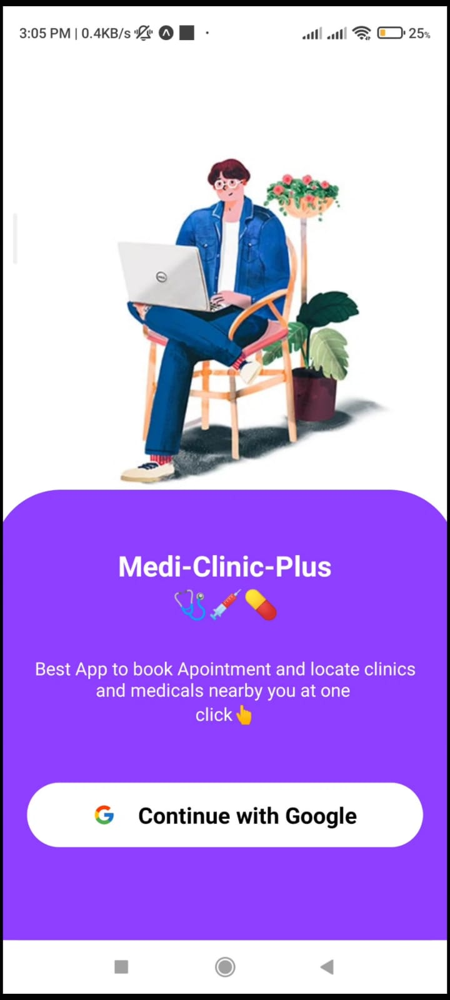
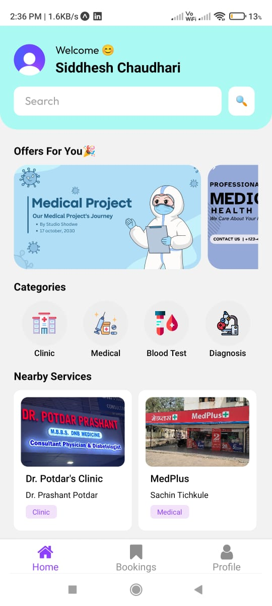
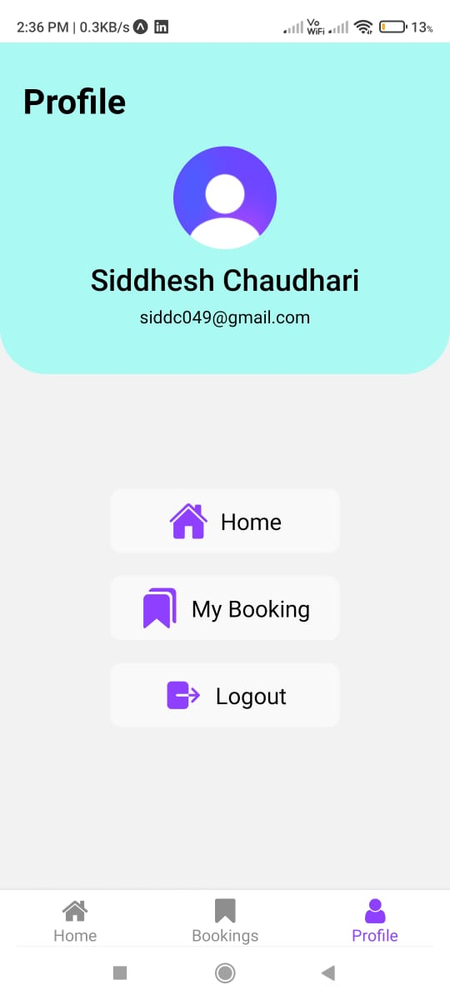
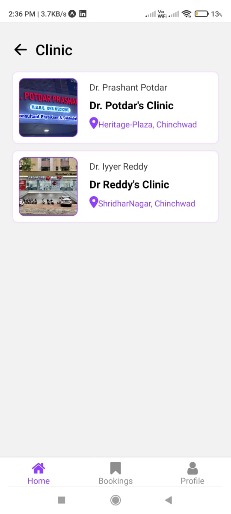
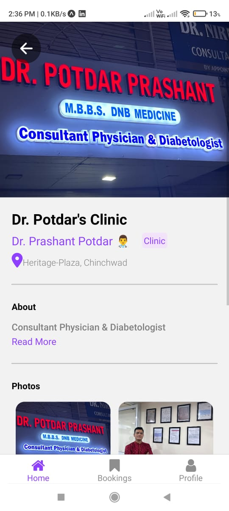
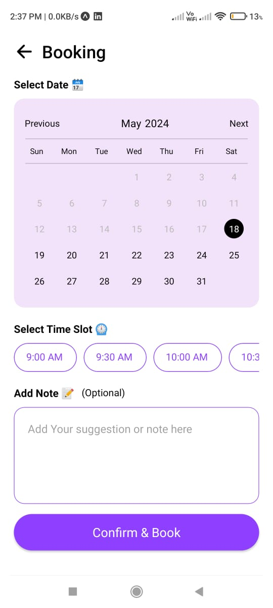
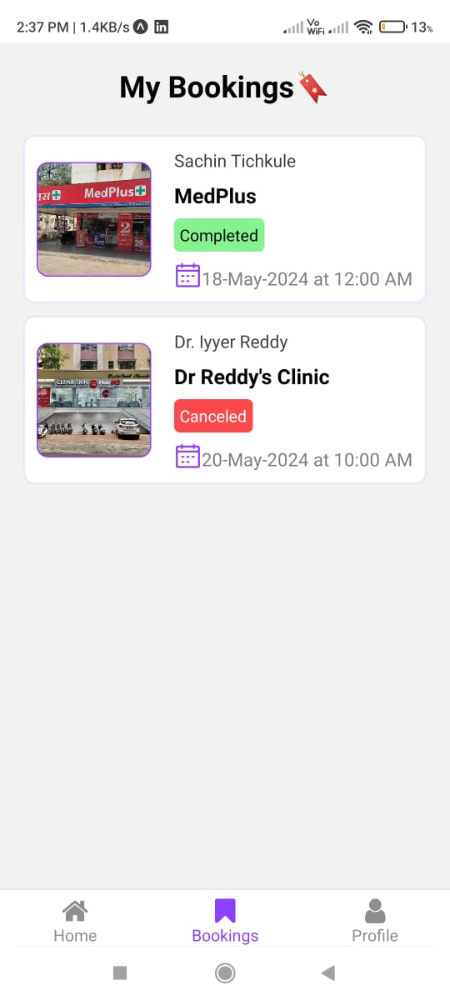

# Med-Clinic-Plus

## Overview
**Med-Clinic-Plus** is a mobile application built using React Native. It allows users to easily find nearby clinics, medical stores, pathology labs, and diagnostic centers. Users can also book appointments through the app. The backend of the application is powered by Hygraph CMS and GraphQL for API fetching. User authentication is handled through Clerk, with Google OAuth for login.

## Features
- **Find Nearby Medical Services:** Locate clinics, medical stores, pathology labs, and diagnostic centers.
- **Book Appointments:** Schedule appointments with healthcare providers directly through the app.
- **Google OAuth Login:** Secure login using Google account via Clerk.
- **Category-Based Business Listing:** View a list of businesses filtered by category.

## Tech Stack
- **Frontend:** React Native
- **Backend:** Hygraph CMS
- **API:** GraphQL
- **Authentication:** Clerk with Google OAuth

## Installation
1. **Clone the repository:**
   ```sh
   git clone https://github.com/Siddc11/Medi-Clinic-Plus.git
   cd Medi-Clinic-Plus
   ```

2. **Install dependencies:**
   ```sh
   npm install
   ```

3. **Run the application:**
   ```sh
   npm start
   ```

## Important Libraries
The following libraries are essential for the functionality of Medi-Clinic-Plus:

- **React Native:** Framework for building native apps using React.
- **React Navigation:** Library for routing and navigation in React Native apps.
- **Clerk:** Authentication service, specifically using the `@clerk/clerk-expo` package for integrating Google OAuth.
- **Expo:** Framework and platform for universal React applications.
- **GraphQL:** Query language for your API, used for data fetching.
- **Apollo Client:** Comprehensive state management library for JavaScript that enables you to manage both local and remote data with GraphQL.
- **Hygraph:** Headless CMS used for backend management.
- **React Native Elements:** Cross-platform React Native UI toolkit.
- **React Query:** Data-fetching library for React.
- **Expo Web Browser:** Used for handling OAuth flows.

## Contribution
Contributions are welcome! Please fork the repository and submit a pull request for any feature requests or bug fixes.

## Images and Demo Video 
<div>
    
    
    
    
</div>
<div>
    
    
    
</div>


---
